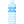
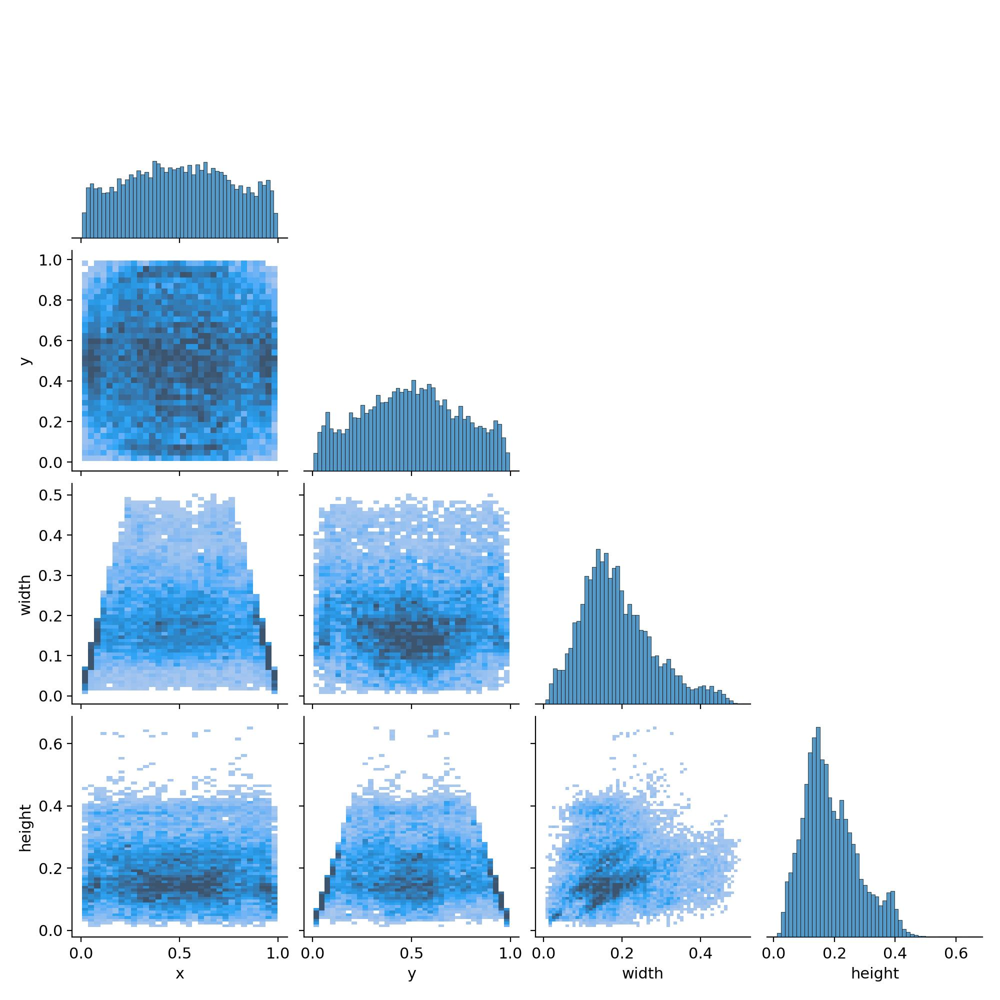
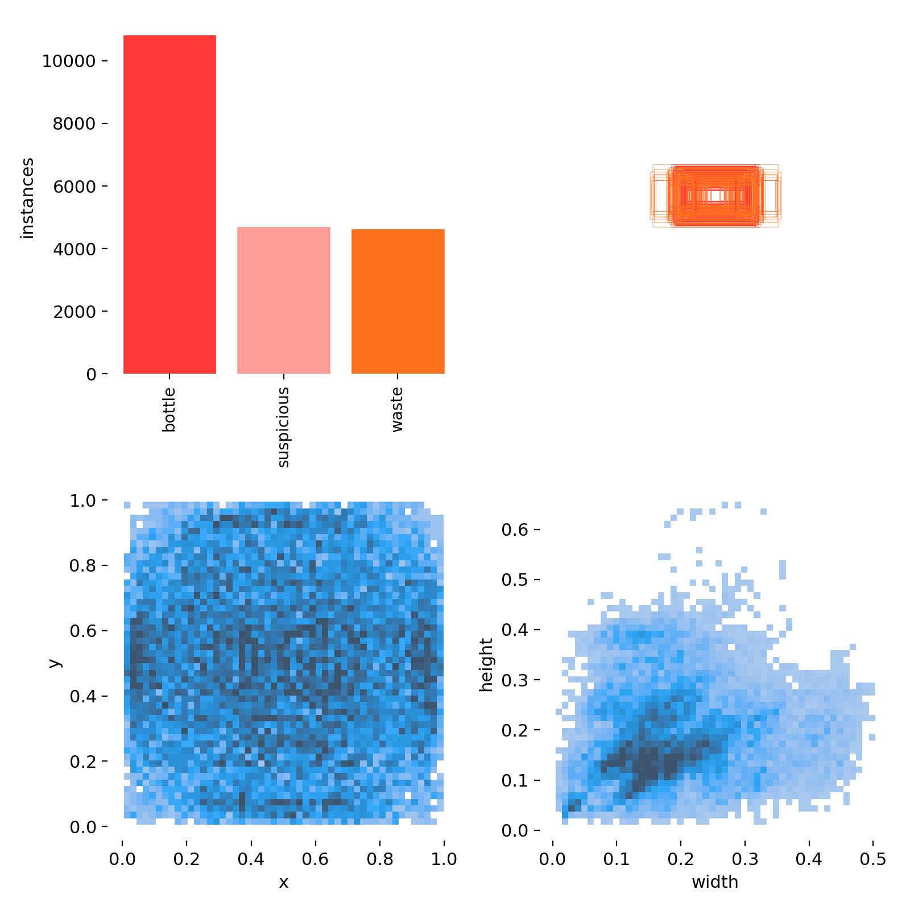

<h1> Bottle Detection using YOLOv8</h1>

This project focuses on detecting bottles in images using the YOLOv8 object detection model. The model is trained on a custom dataset and iteratively improved through multiple test phases to enhance accuracy and reduce false positives.

---

## 🚀 Features

- Object detection using the YOLOv8 framework
- Trained on a custom dataset using Roboflow
- Multiple training tests for performance evaluation
- Optimization by introducing non-bottle objects to reduce false detections
- Insights on lighting, angle, and image quality affecting detection accuracy

---

## 📂 Project Structure

```
bottle-detection/
├── yolov8_train_code_v1.py   # YOLOv8 training script
├── .DS_Store                 # System file (ignore)
```

---

## ⚙️ Requirements

Install dependencies before running the project:

```bash
pip install ultralytics roboflow
```

---

## 🏋️ Model Training

Run `yolov8_train_code_v1.py` to train the model. The dataset is fetched from Roboflow using an API key.  
Make sure to update your API key in the script before running.

---

## 🧪 Training Tests Summary

| Test | Epochs | Training Time | Dataset Type                | Notes                   |
| ---- | ------ | ------------- | --------------------------- | ----------------------- |
| 1    | 30     | 12 minutes    | Only bottle images          | Baseline model          |
| 2    | 45     | 15 minutes    | Only bottle images          | Improved training       |
| 3    | 60     | ~             | Only bottle images          | Extended training       |
| 4    | 60     | ~             | Bottles + Non-bottle images | Reduced false positives |

---

## 🔍 Problem Solving Strategy

In early tests (1–3), the model falsely detected non-bottle objects as bottles due to shared features.  
To mitigate this, additional non-bottle images were added in Test 4, which helped the model better differentiate true bottle features.

---

## 📊 Results & Observations

✅ Detected well in:

- Bright lighting conditions
- Top-down camera positions
- High-resolution images

❌ Issues with:

- Cut bottles (not detected)
- Crushed bottles (misclassified as waste or suspicious)
- Bottles at the edge of the frame (often marked as suspicious)

---

## 💡 Suggested Improvements

Introduce a condition to ensure the entire bottle is visible in the frame before applying detection logic.

---

## 📈 Visual Analysis

The following correlogram provides insight into the distribution and correlation of bounding box attributes (x, y, width, height) used in training:





---

## 📄 License

This project is licensed under the MIT License. See the LICENSE file for details.
